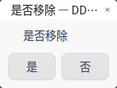

# music-island-B-QT-P
music-island但是QT插件

操作系统版本 deepin20.8

g++版本 8.3.0

C++11

QT版本 5.15.6

# 注意事项
### 使用GPL3.0
## 使用方法:
将so文件复制到 

/usr/lib/dde-dock/plugins(dde-dock)(由于dde-dock高度限制，InformationWidget会显示不全) 

~/.local/lib/dde-top-panel/plugins(dde-top-panel)
## so文件置于Releases
### music-island将创建文件夹(~/.local/lib/music-island-c++p)，用于存放储存数据与下载音乐
### music-island不会自动存储,请自行存储
## 谨慎使用删除文件，数据无价
### music-island.json仅用于使dde-dock/dde-top-panel认为兼容(不可缺少)
# 开始介绍
### 1.我将文件(3MB)放置于这里:

### 2.itemWidget
#### 右键菜单

#### 打开

#### 储存作用于此文件、读取使用此文件

#### 操作演示

#### 按下暂停时音量会匀速减小，按下播放时音量会匀速增大
### 3.itemTipsWidget
#### 暂停时

#### 播放时

### 4.itemPopupApplet
#### 外观

#### 音量 0%~100%
#### 进度条 0%~100%
#### 速度 10%~300%
#### 下载按钮

#### 下载按钮右端显示上次搜索的内容,下次搜索时引用
#### 若查找到

#### 若查找不到

#### 查找到后,若音乐有效,加入音乐列表
#### 若无效

#### 下载音乐储存位置

#### 左部右键菜单

播放方式
{

1.循环播放

2.单曲循环

3.随机播放

4.函数播放法(y=(p/q)x^n+b (x为当前播放的音乐在列表中的位置,y为下一首的目标))

}

#### 右部右键菜单

#### 上下移演示

#### 移除

#### 删除

## 2023/7/4更新
### 1.itemWidget
#### 右键菜单增加

### 2.新增data2.txt储存字体、颜色数据

### 3.设置后像这样

### 4.修复itemPopupApplet播放方式UI bug

## 2023/7/9更新
### 修复bug(大概花了6h)
### 增加歌词支持|爬虫时会爬取歌词
#### so文件大小3.6MB

#### itemPopupApplet 拓展

#### 有歌词情况下

#### 无歌词情况下

#### 设置字体颜色与itemWidget原理相同
#### 在data2.txt中储存歌词字体颜色数据
#### 演示

## 2023/7/11更新(上次好像写了2024)
### 系统更新deepin20.8->deepin20.9|QT5.15.6->QT5.15.8
#### 1.修改lyric_main内容

#### 2.对itemPopupApplet UI进行修改

#### 3.针对dde-dock顶头与lyric_main的歌词显示不明显

#### 4.针对插件的使用与禁用

## 2023/7/12更新
### 修复爬虫bug&修改QListView与修改QPushButton外观
## 2023/7/13更新
### 在InformationLyric中添加 时长/总时长

### 对itemPopupApplet UI进行修改

### 首先声明，这不是由music-island引起的

### 针对dde-dock作出如下修改

### 修改为：在右键时无法触发InformationWidget中的按钮
### 关于V23Beta不能正常使用
#### 有些github上的dde-dock插件对V23Beta有独立的支持
#### dde-dock会禁用插件
#### QT6与QT5有很大区别，兼容应该不理想
#### 实践是检验真理的唯一标准,所以用V23Beta再编译一次(等我搞定硬件问题再说)
## 2023/8/12更新
### 1.修改判断方式，下载不再出现VIP音乐
### 2.增加试听功能
#### 在按下下载、输入字符后，显示界面

{

1.滑动条类似itemPopupApplet的滑动条

2.播放:try_to_listen.play();

3.暂停:try_to_listen.pause();

4.选中:下载音乐与歌词，成功后提示"pass"

5.取消:啥也没做

6.上:上一页(放心，不可能出现-1页)

7.下:下一页(若空，显示页码(多数情况是响应问题，等一等))

}
## 2023/8/27更新
### 1.对informationgetmusic增加仅下载音乐功能

### 2.对itemPopupApplet增加配置歌词功能

#### 点击"配置歌词"配置

### 3.增加等待执行

#### 演示

### 4.增加QTimer进行更新歌词,间隔10s,不会储存
### 5.将播放速度进行更改
{

原:qreal(int/100)

改:qreal(float/100)

}
### 6.修复下载后停止播放变成播放的bug
